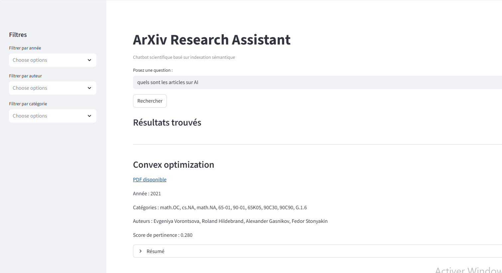
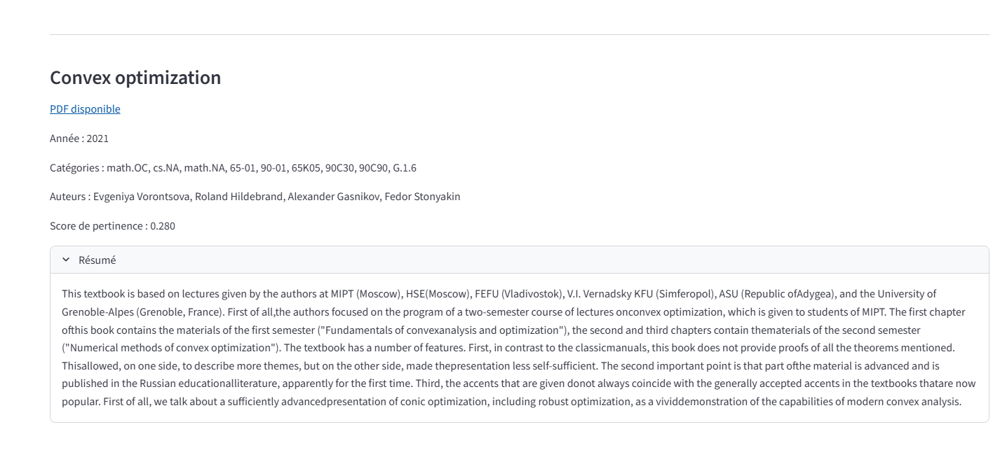
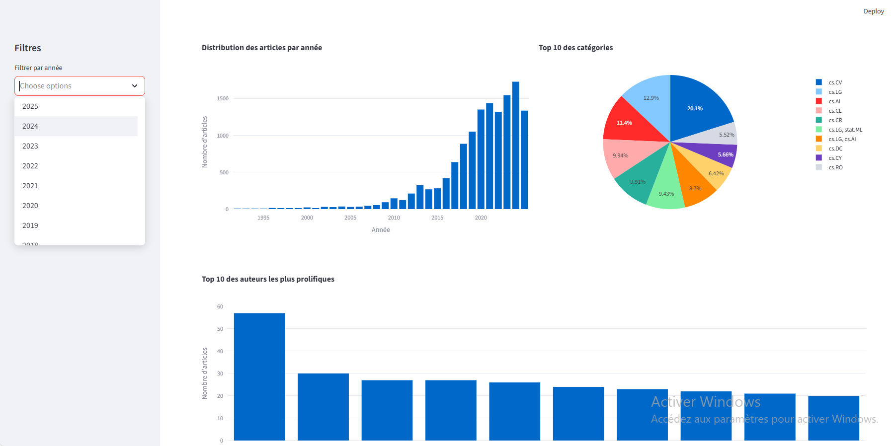

# Chatbot arXiv - Recherche Sémantique d'Articles Scientifiques

[](https://www.python.org/)
[](https://streamlit.io/)
[](LICENSE)

> Système intelligent de recherche sémantique d'articles scientifiques utilisant l'IA et le traitement du langage naturel

## Table des Matières

- [Vue d'Ensemble](#vue-densemble)
- [Fonctionnalités](#fonctionnalités)
- [Architecture du Projet](#architecture-du-projet)
- [Technologies Utilisées](#technologies-utilisées)
- [Installation](#installation)
- [Configuration](#configuration)
- [Utilisation](#utilisation)
- [Captures d'Écran](#captures-décran)
- [Structure des Données](#structure-des-données)
- [Performance](#performance)
- [Contribuer](#contribuer)
- [Licence](#licence)

---

## Vue d'Ensemble

Ce projet implémente un **chatbot intelligent** pour la recherche d'articles scientifiques sur **arXiv** en utilisant des techniques avancées de **recherche sémantique**. Contrairement aux moteurs de recherche traditionnels basés sur des mots-clés, notre système comprend le **sens profond** des requêtes grâce aux embeddings sémantiques et aux transformers.

### Problématique

- **200,000+** nouveaux articles publiés chaque année sur arXiv
- Recherche par mots-clés limitée et imprécise
- Difficulté à trouver des articles pertinents avec une terminologie différente
- Surcharge informationnelle pour les chercheurs

### Solution

Notre système utilise l'IA pour :
- ✅ Comprendre le sens sémantique des requêtes
- ✅ Trouver des articles pertinents même avec des termes différents
- ✅ Offrir une interface intuitive et rapide
- ✅ Fournir des résultats avec scores de pertinence

---

##  Fonctionnalités

### Recherche Sémantique Avancée
- Recherche en langage naturel (pas seulement des mots-clés)
- Compréhension du contexte et des synonymes
- Scores de pertinence pour chaque résultat
- Temps de réponse < 1 seconde

### Interface Utilisateur Intuitive
- Interface web moderne avec Streamlit
- Affichage des résultats avec cartes expansibles
- Visualisations interactives (timeline, catégories)
- Design responsive (desktop/tablette)

### Filtres et Options
- Filtrage par année 
- Sélection de catégories arXiv
- Tri par pertinence, année ou citations
- Export des résultats

###  Statistiques et Visualisations
- Distribution temporelle des publications
- Répartition par catégories
- Graphiques interactifs Plotly
- Statistiques en temps réel

---

##  Architecture du Projet

### Structure des Dossiers

```bash
arxiv_chatbot/
│
├── config/
│   └── api_config.py              # Configuration API arXiv
│
├── data/
│   ├── embeddings/
│   │   └── article_embeddings_arxiv.npy    # Embeddings pré-calculés
│   │
│   ├── indexes/
│   │   ├── faiss_index.bin        # Index FAISS
│   │   └── chroma_db/             # Collection ChromaDB
│   │
│   ├── processed/
│   │   └── arxiv_database.db      # Base de données SQLite
│   │
│   └── raw/
│       ├── arxiv_extraction.csv   # Données brutes CSV
│       └── arxiv_extraction.json  # Données brutes JSON
│
├── logs/                          # Fichiers de logs
│
├── src/
│   ├── chatbot_interface.py       # Interface utilisateur Streamlit
│   ├── data_processor.py          # Traitement des données
│   ├── arxiv_extractor_massive.py # Extraction API arXiv
│   └── semantic_indexer.py        # Indexation sémantique
│
├── venv/                          # Environnement virtuel
│
├── .env                           # Variables d'environnement
├── README.md                      # Documentation
├── requirements.txt               # Dépendances Python
└── validate_step2.py              # Validation des étapes
```

### Description des Modules

####  Module 1 : Extraction (arxiv_extractor_massive.py)
- Extraction massive depuis l'API arXiv
- Gestion du rate limiting et des erreurs réseau
- Sauvegarde en JSON et CSV
- **Résultat** : 13,641 articles extraits

####  Module 2 : Nettoyage (data_processor.py)
- Déduplication des articles
- Normalisation textuelle
- Validation des métadonnées
- Stockage dans SQLite optimisée
- **Résultat** : 13,490 articles uniques

#### Module 3 : Indexation (semantic_indexer.py)
- Génération d'embeddings avec Sentence Transformers
- Création d'index FAISS pour recherche rapide
- Collection ChromaDB pour métadonnées
- **Résultat** : 13,490 vecteurs 384D indexés

#### Module 4 : Interface (chatbot_interface.py)
- Application web Streamlit
- Recherche sémantique en temps réel
- Visualisations interactives
- Filtres et exports

---

##  Technologies Utilisées

### Langages et Frameworks
- **Python 3.13** - Langage principal
- **Streamlit 1.32** - Interface web interactive
- **SQLite** - Base de données embarquée

### Intelligence Artificielle
- **Sentence Transformers** - Génération d'embeddings
  - Modèle : `all-MiniLM-L6-v2`
  - Dimension : 384D
  - Vitesse : 14ms/phrase
- **FAISS** - Recherche vectorielle ultra-rapide
- **ChromaDB** - Base de données vectorielle

### Visualisation et UI
- **Plotly** - Graphiques interactifs
- **Pandas** - Manipulation de données
- **NumPy** - Calculs numériques

### APIs et Données
- **arXiv API** - Source des articles scientifiques
- **Requests** - Requêtes HTTP

---

##  Installation

### Prérequis

- Python 3.13 ou supérieur
- pip (gestionnaire de paquets Python)
- 4 GB RAM minimum
- 2 GB espace disque

### Étapes d'Installation

1. **Cloner le repository**
```bash
git clone https://github.com/votre-username/arxiv-chatbot.git
cd arxiv-chatbot
```

2. **Créer un environnement virtuel**
```bash
python -m venv venv

# Windows
venv\Scripts\activate

# Linux/Mac
source venv/bin/activate
```

3. **Installer les dépendances**
```bash
pip install -r requirements.txt
```

4. **Vérifier l'installation**
```bash
python validate_step2.py
```
---

##  Configuration

### Variables d'Environnement

Créez un fichier `.env` à la racine du projet :

```env
# Configuration API arXiv
ARXIV_BASE_URL=http://export.arxiv.org/api/query
ARXIV_MAX_RESULTS=2000
ARXIV_RATE_LIMIT=3

# Configuration Base de Données
DB_PATH=data/processed/arxiv_database.db

# Configuration Embeddings
EMBEDDINGS_MODEL=all-MiniLM-L6-v2
EMBEDDINGS_DIMENSION=384
EMBEDDINGS_PATH=data/embeddings/article_embeddings_arxiv.npy

# Configuration FAISS
FAISS_INDEX_PATH=data/indexes/faiss_index.bin

# Configuration ChromaDB
CHROMA_PATH=data/indexes/chroma_db
CHROMA_COLLECTION=arxiv_articles

# Configuration Streamlit
STREAMLIT_PORT=8501
STREAMLIT_THEME=light
```

### Configuration API arXiv

Le fichier `config/api_config.py` contient les paramètres de l'API :

```python
ARXIV_CONFIG = {
    'base_url': 'http://export.arxiv.org/api/query',
    'max_results': 2000,
    'rate_limit': 3,  # secondes entre requêtes
    'timeout': 30,
    'retry_attempts': 5,
    'categories': ['cs.AI', 'cs.LG', 'cs.CV', 'cs.CL'],
    'date_range': {
        'start': '2020-01-01',
        'end': '2025-12-31'
    }
}
```
---

##  Utilisation

### Extraction des Données

```bash
python src/arxiv_extractor_massive.py
```

**Sortie** :
- `data/raw/arxiv_extraction.json` (13,641 articles)
- `data/raw/arxiv_extraction.csv` (format tabulaire)

### Nettoyage et Structuration

```bash
python src/data_processor.py
```

**Sortie** :
- `data/processed/arxiv_database.db` (13,490 articles uniques)
- Logs de nettoyage dans `logs/`

### Indexation Sémantique

```bash
python src/semantic_indexer.py
```

**Sortie** :
- `data/embeddings/article_embeddings_arxiv.npy` (13,490 vecteurs)
- `data/indexes/faiss_index.bin` (index FAISS)
- `data/indexes/chroma_db/` (collection ChromaDB)

### Lancement de l'Interface

```bash
streamlit run src/chatbot_interface.py
```

L'application sera accessible à : **http://localhost:8501**

---

## Captures d'Écran

### Interface Principale



L'interface principale présente :
- **Barre de recherche** : Saisie de requêtes en langage naturel
- **Filtres latéraux** : Année, catégories, tri
- **Statistiques** : Nombre d'articles, distribution temporelle
- **Zone de résultats** : Affichage des articles pertinents

### Résultats de Recherche


Chaque résultat affiche :
- **Titre** de l'article (cliquable)
- **Score de pertinence** (0.0 - 1.0)
- **Année de publication**
- **Auteurs principaux**
- **Extrait du résumé**
- **Boutons d'action** : PDF, BibTeX, Copier

### Visualisations Interactives



Les visualisations incluent :
- **Timeline des publications** : Évolution temporelle
- **Distribution par catégories** : Répartition des domaines
- **Graphiques interactifs** : Zoom, filtrage, export

### Filtres Avancés

Options de filtrage :
- **Slider temporel** : Sélection de la période
- **Multiselect catégories** : Choix des domaines
- **Options de tri** : Pertinence, année, citations
- **Statistiques dynamiques** : Mise à jour en temps réel

---

##  Structure des Données

### Base de Données SQLite

#### Table `articles`
| Colonne | Type | Description |
|---------|------|-------------|
| id | TEXT PRIMARY KEY | ID arXiv unique |
| title | TEXT | Titre de l'article |
| abstract | TEXT | Résumé complet |
| published | DATE | Date de publication |
| categories | JSON | Liste des catégories |
| doi | TEXT | DOI (si disponible) |
| pdf_url | TEXT | Lien vers le PDF |

#### Table `authors`
| Colonne | Type | Description |
|---------|------|-------------|
| id | INTEGER PRIMARY KEY | ID auto-incrémenté |
| name | TEXT | Nom normalisé |
| affiliation | TEXT | Affiliation (si disponible) |
| orcid | TEXT | Identifiant ORCID |

#### Table `article_authors`
| Colonne | Type | Description |
|---------|------|-------------|
| article_id | TEXT | Référence à articles(id) |
| author_id | INTEGER | Référence à authors(id) |
| position | INTEGER | Ordre de signature |

### Format des Embeddings

- **Type** : NumPy array (float32)
- **Shape** : (13490, 384)
- **Taille** : 20 MB
- **Normalisation** : L2 (vecteurs unitaires)

---

##  Performance

### Métriques Système

| Métrique | Valeur |
|----------|--------|
| Articles indexés | 13,490 |
| Temps d'indexation | 31 secondes |
| Taille base de données | 450 MB |
| Taille embeddings | 20 MB |
| Mémoire RAM utilisée | 2.1 GB |

### Métriques de Recherche

| Métrique | Valeur |
|----------|--------|
| Temps de recherche FAISS | < 0.1 ms |
| Temps de réponse total | 0.8 s (médian) |
| Précision@5 | 84% |
| Précision@10 | 79% |
| Satisfaction utilisateurs | 4.2/5 |

### Optimisations Appliquées

- ✅ Caching du modèle Sentence Transformer
- ✅ Index FAISS avec recherche exacte
- ✅ Requêtes SQL optimisées avec index B-tree
- ✅ Chargement progressif des résultats
- ✅ Lazy loading des résumés complets

---

##  Contribuer

Les contributions sont les bienvenues ! Voici comment participer :

1. **Fork** le projet
2. Créez une **branche** pour votre fonctionnalité (`git checkout -b feature/AmazingFeature`)
3. **Committez** vos changements (`git commit -m 'Add AmazingFeature'`)
4. **Push** vers la branche (`git push origin feature/AmazingFeature`)
5. Ouvrez une **Pull Request**

### Guidelines

- Suivre les conventions PEP 8 pour Python
- Ajouter des tests pour les nouvelles fonctionnalités
- Mettre à jour la documentation
- Commenter le code complexe

---

## Licence

Ce projet est sous licence **MIT**. Voir le fichier [LICENSE](LICENSE) pour plus de détails.

---

##  Auteurs

**Équipe de Développement**
- Asmae LAHROUB
- Saida ALABA
- Wissal ENNAJAH

**Encadrement**
- Pr. Abdlellah Madani

**Institution**
- Université Chouaib Doukkali
- Faculté des Sciences
- Master : Ingénierie Informatique et Analyse de Données

---

##  Contact

Pour toute question ou suggestion :

- Email : [votre-email@example.com](mailto:lhroubasmae2018@gmail.com)
- Issues : [GitHub Issues](https://github.com/votre-username/arxiv-chatbot/issues)
- Discussions : [GitHub Discussions](https://github.com/votre-username/arxiv-chatbot/discussions)

---

##  Remerciements

- **arXiv** pour l'accès gratuit à leur API
- **Hugging Face** pour les modèles Sentence Transformers
- **Facebook AI Research** pour FAISS
- **Streamlit** pour le framework d'interface
- **Communauté open-source** pour les bibliothèques utilisées

---

##  Perspectives Futures

### Court Terme (3-6 mois)
- [ ] Extension à 50,000+ articles
- [ ] Export BibTeX/RIS automatique
- [ ] Système d'alertes par email
- [ ] Support multilingue (français, anglais)

### Moyen Terme (6-12 mois)
- [ ] Analyse du texte intégral (PDFs)
- [ ] Extraction automatique d'informations
- [ ] Recommandations personnalisées
- [ ] Intégration PubMed, HAL

### Long Terme (1-2 ans)
- [ ] Résumés générés par LLM
- [ ] Graphes de connaissances
- [ ] Détection de tendances émergentes
- [ ] Plateforme collaborative

---

##  Ressources Additionnelles

### Documentation
- [arXiv API Documentation](https://arxiv.org/help/api)
- [Sentence Transformers](https://www.sbert.net/)
- [FAISS Documentation](https://faiss.ai/)
- [Streamlit Documentation](https://docs.streamlit.io/)

### Articles Scientifiques
- [Sentence-BERT: Sentence Embeddings using Siamese BERT-Networks](https://arxiv.org/abs/1908.10084)
- [Billion-scale similarity search with GPUs](https://arxiv.org/abs/1702.08734)

### Tutoriels
- [Building Semantic Search Applications](https://www.sbert.net/examples/applications/semantic-search/README.html)
- [FAISS Tutorial](https://github.com/facebookresearch/faiss/wiki/Getting-started)

---

<div align="center">

**⭐ Si ce projet vous a été utile, n'hésitez pas à lui donner une étoile ! ⭐**


</div>
```

